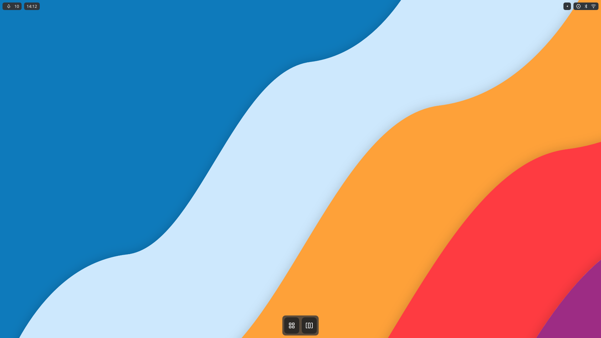

# Maui Shell


[](https://www.gnu.org/licenses/lgpl-3.0) [](https://awesome.re) [](https://shields.io/)

_Maui Shell is a convergent shell for desktops, tablets, and phones._

Maui Shell is composed of two parts:

- Cask is the shell container and elements templates, such as panels, popups, cards etc.
- Zpace is the composer, which is the layout and places the windows or surfaces into the Cask container.

# Screenshots



# Install guide for Maui Shell

Distro of choice and the prerequisites: We attempted using other Debian based rolling release distributions as well but they did not work as well with the dependencies and the prerequisites, so we recommend Debian Testing KDE-Plasma. (Specifically Plasma since there are way too many dependency downloads required on other DEs). If not Debian Testing, you can still add the Debian sources in /etc/apt/sources.list)

<details>
  <p>
</p>
  <summary>“You are not in sudoers file” fix for Debian testing</summary>
  <p>
</p>
  <pre>

  <code>  su<br>  sudo adduser &lt;your_username&gt; sudo<br>  Reboot
</code>
</pre>
  <p>
</p>
</details>

## Prerequisites

The following list contains all the apt installable dependencies that are necessary for Maui Shell to run.

```
libcanberra-dev
libkf5config-dev
libkf5coreaddons-dev
libkf5i18n-dev
libkf5kio-dev
libkf5notifications-dev
libkf5service-dev
libqt5svg5-dev
libqt5waylandcompositor5-dev
qtbase5-dev
qtdeclarative5-dev
qtquickcontrols2-5-dev
cmake
extra-cmake-modules
libqt5x11extras5-dev
Libqt5svg5-dev
libxcb-shape0-dev
libxcb-icccm4-dev
libpulse-dev
pkg-config
qml-module-qtwayland-compositor
```

_Note: Ensure extra-cmake-modules version is >5.70, and cmake version is >3.20_

Install any missing QML modules from the Synaptic Package Manager, or with Aptitude.

<details><p>
</p><summary>If you are using Deb testing, install these via Synaptic/Aptitude</summary>


  <code>qml-module-Qt.labs.calendar
qml-module-qtquick.shapes</code><br><p>
</p></details>

 

<details><p>
</p><summary>If you are using any other distro, install these via Synaptic/Aptitude</summary>


  <code>qml-module-org.kde.kirigami2
qml-module-qtgraphicseffects
qml-module-qtquick.window
qml-module-qtquick.layouts
qml-module-qtquick.controls
qml-module-qtquick.controls2
qml-module-Qt.labs.calendar
qml-module-qtquick.shapes
bluedevil
plasma-nm</code><br><p>
</p></details>

This is the point when we encountered errors and there were just too many dependencies that were still missing. After these, you're on your own.

<details><p>
</p><summary>final error log</summary>


  <code>QObject: Cannot create children for a parent that is in a different thread.
(Parent is QGuiApplication(0x7ffe8885b590), parent's thread is QThread(0x55e1b3f57400), current thread is QThread(0x55e1b40fc3e0)
QObject::installEventFilter(): Cannot filter events for objects in a different thread.
Icon theme "breeze" not found.
QQmlApplicationEngine failed to load component
qrc:/qml/main.qml:16:5: Type Screen unavailable
qrc:/qml/Screen.qml:112:32: Type StatusBar unavailable
qrc:/qml/shell/statusbar/StatusBar.qml:217:13: Type SlidersItem unavailable
qrc:/qml/shell/statusbar/items/sliders/SlidersItem.qml:62:17: Type VolumeSlider unavailable
qrc:/qml/shell/statusbar/items/sliders/volume/VolumeSlider.qml:13:1: module "org.kde.plasma.private.volume" is not installed</code><br><p>
</p></details>

You can use [packages.debian.org](https://packages.debian.org/testing/), along with `apt-file search` to cross reference missing packages

After obtaining prerequisites the process is fairly easy, assuming you don't encounter random errors.

## To build MauiKit (A prerequisite for Maui Shell):

1. `git clone https://anongit.kde.org/mauikit`
2. `cd mauikit`
3. `mkdir build && cd build`
4. `cmake .. -DCMAKE_INSTALL_PREFIX=/usr`
5. `make`
6. `sudo make install`

## To build Maui Shell

1. `git clone --depth 1 --branch master https://github.com/Nitrux/maui-shell.git`
2. `mkdir -p maui-shell/build && cd maui-shell/build`
3. `cmake -DCMAKE_INSTALL_PREFIX=/usr -DENABLE_BSYMBOLICFUNCTIONS=OFF -DQUICK_COMPILER=ON -DCMAKE_BUILD_TYPE=Release -DCMAKE_INSTALL_SYSCONFDIR=/etc -DCMAKE_INSTALL_LOCALSTATEDIR=/var -DCMAKE_EXPORT_NO_PACKAGE_REGISTRY=ON -DCMAKE_FIND_PACKAGE_NO_PACKAGE_REGISTRY=ON -DCMAKE_INSTALL_RUNSTATEDIR=/run "-GUnix Makefiles" -DCMAKE_VERBOSE_MAKEFILE=ON -DCMAKE_INSTALL_LIBDIR=lib/x86_64-linux-gnu ..`
4. `make`
5. `sudo make install`

# Running

Once you're done installing Maui Shell, we recommend you run it via cask in the build directory to run it as a window in an X11 session, and check the logs once. Then you can log in via caskx11 the DE picker.

If you want to run it on the Linux console without an X11 session (which is much more efficient), you can use a startup script like this:

```
#!/bin/sh
export QT_QPA_PLATFORM=eglfs

# don't enlarge stuff on "high-res" displays
export QT_AUTO_SCREEN_SCALE_FACTOR=0

# in case it's not detected
# or you wish to override
#
# export QT_QPA_EGLFS_PHYSICAL_WIDTH=480
# export QT_QPA_EGLFS_PHYSICAL_HEIGHT=270

# try to restart if it crashes; write a log file
cask -r -l /tmp/cask.log
```

If you are on the console and have a problem with the keyboard, mouse, etc. don't work (which should be fixed in Qt 5.6 and above, theoretically) you can try various input plugins (after rebooting via ssh, or the power button ;-) by adding

```
-plugin EvdevTouch -plugin EvdevMouse -plugin EvdevTablet -plugin EvdevKeyboard
```

or

```
-plugin libinput
```

Cask can run Weston and GTK3 apps too eventually; that's mainly a matter of QtWayland having the XDG shell support finished.

Cask does not include an embedded X server yet, but it might be possible.

# Issues

If you find problems with the contents of this repository please create an issue. We also recommend checking out [this](https://t.me/mauiproject) Telegram group that might be helpful to diagnose and work on your unique error.

**©2021 Nitrux Latinoamericana S.C.**
