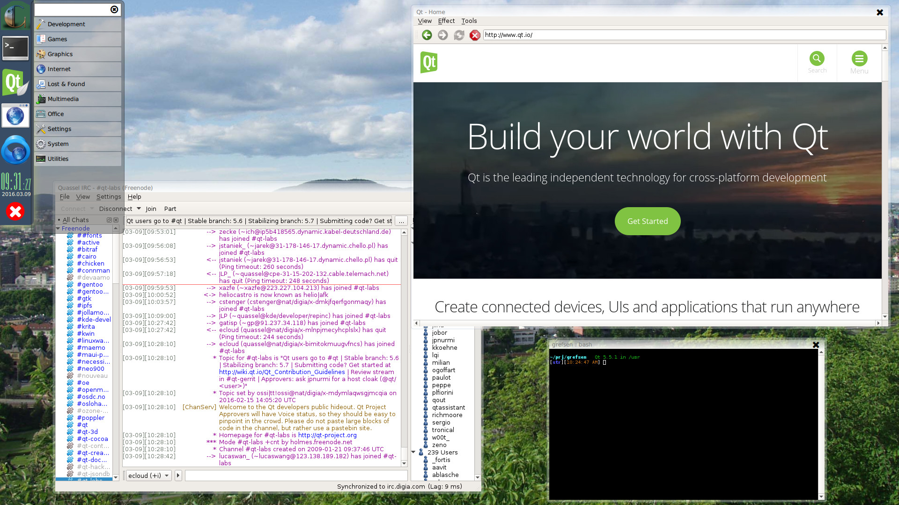

Grefsen is a Qt/Wayland compositor providing a minimal desktop environment.



# Requirements

* Qt 5.15 (if you need 5.x, use the 5.x branch)
  - qtbase, qtdeclarative, qtwayland
  - QtQuick.Controls 2
  - QtQuick.Controls 1, only for the calendar popover
* libQtXdg
  - Arch Linux: install [community/libqtxdg](https://www.archlinux.org/packages/community/x86_64/libqtxdg/)
  - Ubuntu: apt-get install libqt5xdg-dev
  - otherwise: build from [github](https://github.com/lxde/libqtxdg) with Qt 5.7 and cmake
* for the Connman network manager popover (optional): [libconnman-qt](https://git.merproject.org/mer-core/libconnman-qt)
* FontAwesome, but it's a submodule here
* recommended: [freefonts](http://ibiblio.org/pub/linux/X11/fonts/freefonts-0.10.tar.gz) but hopefully your distro has that as a package
  - the clock uses Manzanita, which is also installed as a resource in the executable, just in case
  - WindsorDemi is another nice font, but it will fall back to others if that is not installed

# Building

```
git submodule update --init --recursive
qmake
make
```

# Installation

```
mkdir ~/.config/grefsen
cp example-config/*.qml ~/.config/grefsen
```

Then modify to taste.  If you want the wallpaper shown in the screenshot, download
the full-resolution version from
[wikipedia](https://commons.wikimedia.org/wiki/File:Oslo_mot_Grefsentoppen_fra_Ekeberg.jpg)
to your ~/.config/grefsen directory.

# Running

It can run as a window inside an X11 session.

If you want to run it on the Linux console without an X11 session
(which is much more efficient), you can use a startup script like this:

```
#!/bin/sh
export QT_QPA_PLATFORM=eglfs
export QT_AUTO_SCREEN_SCALE_FACTOR=0 # don't embiggen stuff on "high-res" displays
#export QT_QPA_EGLFS_PHYSICAL_WIDTH=480 # in case it's not detected
#export QT_QPA_EGLFS_PHYSICAL_HEIGHT=270 # or you wish to override
# try to restart if it crashes; write a log file
~/src/grefsen/grefsen -r -l /tmp/grefsen.log
```

If you are on the console and have the problem that the keyboard, mouse etc.
don't work (which should be fixed in Qt 5.6 and above, theoretically) you can
try various input plugins (after rebooting via ssh, or the power button ;-) by adding
```-plugin EvdevTouch -plugin EvdevMouse -plugin EvdevTablet -plugin EvdevKeyboard```
or
```-plugin libinput```

The set of applications you can run inside is mostly limited to those
that are built with Qt 5, so far.  That includes a lot of KDE applications.
It is intended to eventually be able to run weston and GTK3 apps too;
that's mainly a matter of qtwayland having the XDG shell support finished.
Grefsen does not include an embedded X server yet, but it might be possible.

The application menu uses libqtxdg to find .desktop files and .menu files
in a way which is compliant with the
[XDG menu spec](https://specifications.freedesktop.org/menu-spec/menu-spec-1.0.html),
which means that you have some control over the contents of the menu, if you
don't mind editing XML files.  But grefsen does not try to prevent you from
running incompatible applications: they will simply fail to launch.  So you
might want a custom menu just for grefsen, whereas by default you will probably
see all the same applications as you do in your usual desktop environment.

[YAT](https://github.com/jorgen/yat) is another terminal alternative.
It's planned to have better touchscreen support soon (flicking with your
finger, text selection when you drag a mouse), whereas konsole still doesn't.
